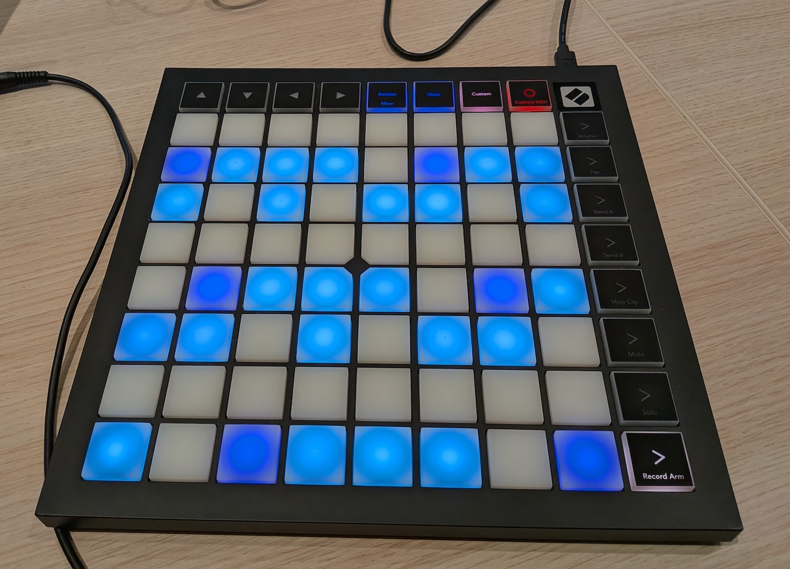

# XEDO

*A microtonal sampler/synthesizer and isomorphic layout for the Launchpad X*

Visually represents and plays [equal temperament tunings](https://en.wikipedia.org/wiki/Equal_temperament) (aka. "n-TET" or "n EDO"). Written in 48 hours during an audio hackathon.



## Requirements

* The Go compiler
* A Novation Launchpad X

## Usage

```
go build .
./xedo [--demo] [--edo <N>] [--freq <F>]
```

* Demo mode cycles through colorful pixel art
* `--edo` sets the initial number of divisions of the octave (defaults to 12)
* `--freq` sets the base frequency for the layout (defaults to 440Hz)

## View

For each EDO tuning, the pad represents the base frequency (and its other octaves) in purple.

The key layout is isomorphic: moving right always increases by a fixed number of steps, and moving up similarly. For instance, for the standard 12 EDO, we move up by one semitone and right by one full tone. The program always fits a full octave horizontally.

The layout tiles infinitely in all directions, and a single note appears multiple times. When pressing a key, all notes of the same pitch are lit up in red.

It then colors an equivalent to a standard major scale within this tuning, in blue.

For tunings that can be exactly divided into 5 large intervals and 2 small intervals, it will map to the major scale exactly. For instance, in 19 EDO, the octave is split into 5 “tones” of 3 steps, and 2 “semitones” of 2 steps.

For the others, it will find the closest approximation.

## Shortcuts

* The four arrow buttons shift the pad’s view to access lower or higher octaves.
* The blue buttons at the top of the pad (“Session” and “Note”) are used to increase or decrease the number of divisions of the octave.
* The pink button (“Custom”) cycles through instruments (piano, sine, square, saw, triangle).
* The red button shuts down the player
* The bottom right button (“> Record arm”) toggles the pedal (keeping sounds playing even after releasing the keys).

## Credits

* Character pixel art by [Johan Vinet](https://johanvinet.tumblr.com/post/127476776680/here-are-100-characters-8x8-pixels-using-the).
* Piano samples: [Salamander Grand Piano](https://github.com/sfzinstruments/SalamanderGrandPiano) v3 by Alexander Holm, Creative Commons Attribution 3.0 Unported License.

## License

XEDO is Copyright Noé Falzon 2026, and published under the [MIT license](LICENSE.md)
